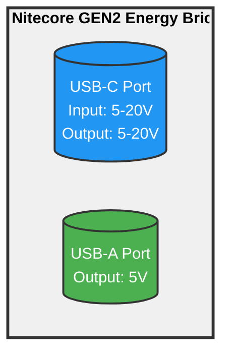
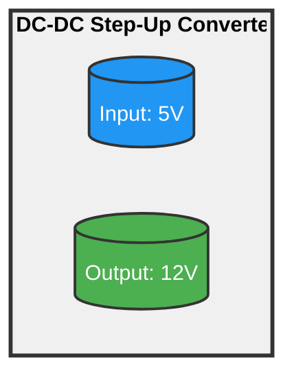
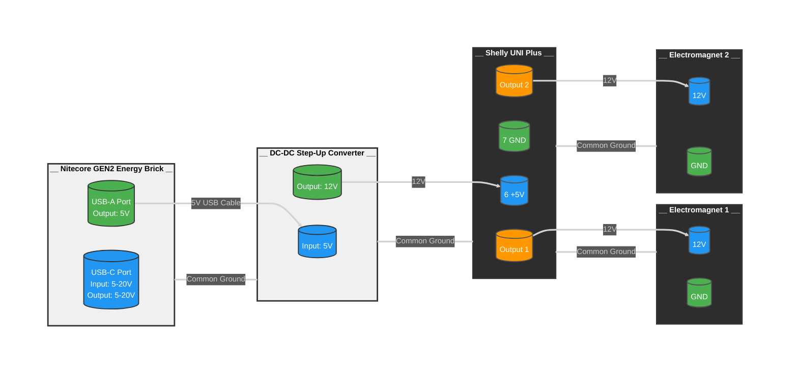

# 100 - Network Diagrams

## 100 - Power Bank Diagram

The diagram shows the Energy Brick housing containing a USB-C port that supports both input and output (5-20V) and a USB-A port that provides 5V output only.

## 200 - DC DC Step-Up Converter Diagram

The diagram shows the DC-DC Step-Up Converter with an input port accepting 5V power source and an output port providing stepped-up 12V power. The voltage conversion happens within the converter housing, making it useful for powering 12V devices from 5V USB power sources.

## 300 - Shelly UNI Plus Diagram

```mermaid
%%{init: {'theme':'dark', 'themeVariables': { 'fontSize': '16px'}, "flowchart" : { "width": 1400, "height": 400, "diagramPadding": 50 }} }%%
graph LR
subgraph ShellyUNI["__ Shelly UNI Plus ___"]
    direction TB
    subgraph Inputs["Inputs"]
        direction LR
        VDC[("6 +5V")]
        GND[("7 GND")]
    end
    subgraph Outputs["Outputs"]
        direction LR
        Out1[("Output 1")]
        Out2[("Output 2")]
    end
end
style ShellyUNI fill:#2d2d2d,stroke:#333,stroke-width:3px,color:#fff,font-weight:bold
style Inputs fill:#1a1a1a,stroke:none
style Outputs fill:#1a1a1a,stroke:none
style VDC fill:#2196F3,stroke:#555,stroke-width:2px,color:#fff
style GND fill:#4CAF50,stroke:#555,stroke-width:2px,color:#fff
style Out1 fill:#ff9800,stroke:#555,stroke-width:2px,color:#fff
style Out2 fill:#ff9800,stroke:#555,stroke-width:2px,color:#fff
```

The diagram shows:
- VDC (Grey wire) - +5VDC power input on port 6
- GND (Turquoise wire) - Ground connection on port 7 
- Shelly UNI Plus device housing

## 400 - Electromagnet Diagram

```mermaid
%%{init: {'theme':'dark', 'themeVariables': { 'fontSize': '16px'}, "flowchart" : { "width": 1400, "height": 400, "diagramPadding": 50 }} }%%
graph LR
subgraph Electromagnet["__ Electromagnet ___"]
    direction TB
    subgraph Inputs["Inputs"]
        direction LR
        Pin1[("12V")]
        Pin2[("GND")]
    end
end
style Electromagnet fill:#2d2d2d,stroke:#333,stroke-width:3px,color:#fff,font-weight:bold
style Inputs fill:#1a1a1a,stroke:none
style Pin1 fill:#2196F3,stroke:#555,stroke-width:2px,color:#fff
style Pin2 fill:#4CAF50,stroke:#555,stroke-width:2px,color:#fff
```

## 900 - Assembly Diagram

The assembly diagram now shows the complete power flow:
1. The Nitecore GEN2 Energy Brick provides 5V output through its USB-A port
2. This 5V is connected to the DC-DC Step-Up Converter input via a USB cable
3. The Step-Up Converter boosts the voltage to 12V
4. The 12V output connects to the Shelly UNI Plus VDC5 input (Note: Although labeled as +5V, this input accepts 12V which is required to power the electromagnets)
5. The Shelly UNI Plus outputs (1 & 2) connect to the respective electromagnets
6. Ground connections are maintained throughout the system